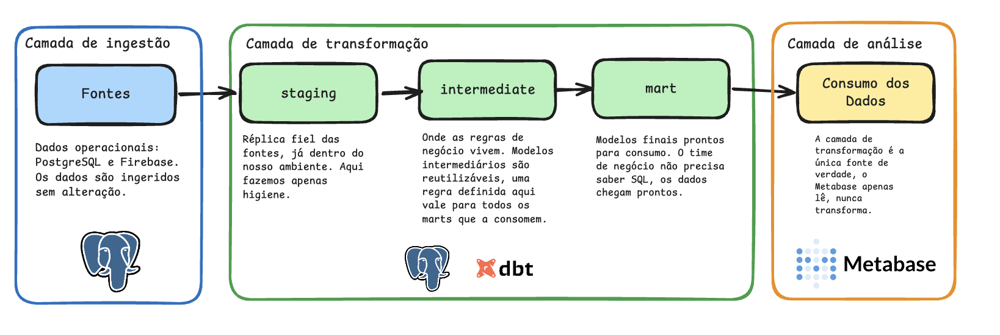
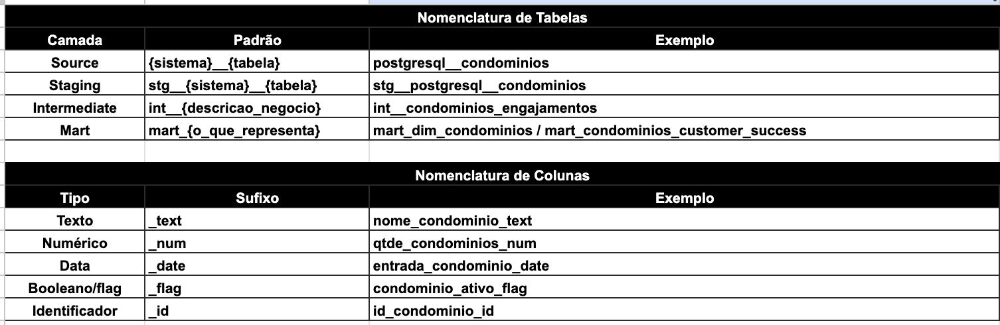
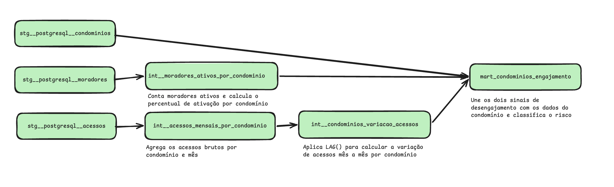

## Setup: Definição das Tabelas

```sql
-- Compatível com PostgreSQL 15+ 
-- Para rodar no DuckDB/SQLiteOnline, ver notas de compatibilidade ao longo do arquivo

CREATE TABLE condominios (
    id_condominio TEXT PRIMARY KEY
    , nome TEXT
    , cidade TEXT
    , timezone TEXT
    , plano TEXT
    , data_ativacao DATE
    , status TEXT
);

CREATE TABLE moradores (
    id_morador TEXT PRIMARY KEY
    , id_condominio TEXT REFERENCES condominios(id_condominio)
    , nome TEXT
    , unidade TEXT
    , data_cadastro DATE
    , ativo BOOLEAN
);

CREATE TABLE ocorrencias (
    id_ocorrencia TEXT PRIMARY KEY
    , id_condominio TEXT REFERENCES condominios(id_condominio)
    , id_morador TEXT REFERENCES moradores(id_morador)
    , tipo TEXT
    , data_hora TIMESTAMP
    , status TEXT
    , tempo_resolucao_horas NUMERIC
);

CREATE TABLE acessos (
    id_acesso TEXT PRIMARY KEY
    , id_condominio TEXT REFERENCES condominios(id_condominio)
    , id_morador TEXT REFERENCES moradores(id_morador)
    , data_hora_local TIMESTAMPTZ
    , canal TEXT
);
```

---

## Parte 1: SQL

---

### Questão 1 — Qualidade de Dados: `tempo_resolucao_horas`

#### Análise exploratória: a régua de qualidade não pode ser única

A primeira hipótese natural seria aplicar um threshold global (ex: P95 geral) para identificar outliers. A análise exploratória dos dados mostrou que isso seria um erro: **o comportamento esperado de `tempo_resolucao_horas` varia radicalmente por tipo de ocorrência.**

**Distribuição real por tipo (ocorrências resolvidas):**

| Tipo | Total | Mediana (h) | P75 (h) | P95 (h) | Máximo (h) |
|---|---|---|---|---|---|
| `reclamacao` | 943 | 34,2 | 72,3 | 215,2 | 1.888,9 |
| `manutencao` | 554 | 17,7 | 36,8 | 114,9 | 1.832,4 |
| `entrega` | 1.277 | 2,0 | 3,5 | 588,8 | 1.989,0 |
| `visita` | 978 | 1,2 | 2,1 | 521,7 | 1.985,1 |

O dado mais revelador: para `visita` e `entrega`, a mediana é de 1-2h e o P75 é de 2-3,5h. Mas o P95 explode para 500+ horas. Isso não é resolução lenta. São **ocorrências zumbi**: o usuário não fechou a ocorrência na plataforma, ela ficou em aberto e foi encerrada automaticamente ou de forma retroativa muito tempo depois. É um problema de comportamento do usuário, não um bug técnico no dado em si.

Para `manutenção` e `reclamação`, a distribuição é coerente com um processo real que demora mais: a mediana de 18-34h e P95 de 115-215h fazem sentido operacionalmente.

#### Descoberta adicional: dados com data inválida

Durante o carregamento dos dados, foram identificadas **~96 ocorrências com `data_hora = 9999-99-99`**, um valor sentinel que o sistema de origem usa quando a data é desconhecida. Esses registros foram recebidos com `data_hora = NULL` no banco e precisam de investigação na origem.

#### Query de diagnóstico com thresholds por tipo

```sql
-- Q1a: Diagnóstico com thresholds diferenciados por tipo de ocorrência
-- A lógica de "saudável" depende do que é esperado para cada tipo

WITH
    thresholds AS (
    -- Limites definidos com base na distribuição real dos dados
    -- e no processo de negócio esperado para cada tipo
    -- IMPORTANTE: esses valores devem ser validados com o time de negócio
        SELECT 
            'visita' AS tipo
            , 4 AS alerta_h
            , 72 AS exclusao_h 
        UNION ALL
        SELECT 
            'entrega' AS tipo
            , 4 AS alerta_h
            , 72 AS exclusao_h 
        UNION ALL
        SELECT 
            'manutencao' AS tipo
            , 48 AS alerta_h
            , 720 AS exclusao_h 
        UNION ALL
        SELECT 
            'reclamacao' AS tipo
            , 72 AS alerta_h
            , 720 AS exclusao_h 
    )

    , classificado AS (
        SELECT
            o.tipo
            , o.status
            , CASE
                WHEN o.data_hora IS NULL
                    THEN 'ERRO: data inválida (9999-99-99 na origem)'
                WHEN o.tempo_resolucao_horas IS NULL AND o.status = 'resolvida'
                    THEN 'ERRO: nulo em ocorrência resolvida'
                WHEN o.tempo_resolucao_horas IS NULL
                    THEN 'OK: nulo esperado pelo status'
                WHEN o.tempo_resolucao_horas > t.exclusao_h
                    THEN 'ALERTA: ocorrência zumbi (usuário não fechou)'
                WHEN o.tempo_resolucao_horas > t.alerta_h
                    THEN 'ALERTA: acima do esperado para o tipo'
                ELSE
                    'OK: dentro do esperado'
            END AS categoria
            , t.alerta_h
            , t.exclusao_h
        FROM ocorrencias o
        LEFT JOIN thresholds t
            ON o.tipo = t.tipo
    )

SELECT
    tipo,
    , status
    , categoria
    , alerta_h AS "limite alerta (h)"
    , exclusao_h AS "limite exclusão SLA (h)"
    , COUNT(*) AS qtd
    , ROUND(100.0 * COUNT(*) / SUM(COUNT(*)) OVER (PARTITION BY tipo), 1) AS pct_no_tipo
FROM classificado
GROUP BY 
    tipo
    , status
    , categoria
    , alerta_h
    , exclusao_h
ORDER BY tipo, qtd DESC;
```

```sql
-- Q1b: Exposição das ocorrências zumbi em visita e entrega
-- Mostra o impacto do comportamento do usuário na qualidade do dado

SELECT
    tipo
    , COUNT(*) FILTER (WHERE tempo_resolucao_horas <= 4) AS "OK (≤4h)"
    , COUNT(*) FILTER (WHERE tempo_resolucao_horas > 4 AND tempo_resolucao_horas <= 72) AS "Alerta (4-72h)"
    , COUNT(*) FILTER (WHERE tempo_resolucao_horas > 72) AS "Zumbi (>72h)"
    , ROUND(
        100.0 * COUNT(*) FILTER (WHERE tempo_resolucao_horas > 72)
        / NULLIF(COUNT(*), 0), 1
    ) AS "% Zumbi"
FROM ocorrencias
WHERE 
    status = 'resolvida'
    AND tempo_resolucao_horas IS NOT NULL
    AND tipo IN ('visita', 'entrega')
GROUP BY tipo;
```

#### Política de tratamento documentada

| Tipo | Dado saudável | Alerta | Excluir do SLA |
|---|---|---|---|
| `visita` | ≤ 4h | > 4h | > 72h (zumbi) |
| `entrega` | ≤ 4h | > 4h | > 72h (zumbi) |
| `manutenção` | ≤ 48h | > 48h | > 720h |
| `reclamação` | ≤ 72h | > 72h | > 720h |
| Qualquer | `data_hora IS NULL` | — | Excluir (origem inválida) |
| Qualquer | NULL + status `resolvida` | — | Excluir do SLA |
| Qualquer | NULL + status `aberta`/`cancelada` | — | Manter (esperado) |

#### Recomendação de produto (além do dado)

O maior problema de qualidade aqui não é técnico, é comportamental. Os usuários de `visita` e `entrega` não estão confirmando o encerramento das ocorrências na plataforma. A solução de longo prazo não é filtrar esses dados, é **eliminar a causa**:

- Implementar notificação automática para o usuário após 1h sem confirmação em `visita`/`entrega`
- Para `manutenção`/`reclamação`, notificação após 24h sem atualização
- Isso melhora o dado E a experiência do morador simultaneamente

A definição precisa dos thresholds (4h, 48h, 72h etc.) deve ser validada com o time de negócio antes de virar regra oficial, o que é saudável para o processo de `manutenção` pode variar muito dependendo do tipo de condomínio e do contrato de SLA com o cliente.

---

### Questão 2 — Tempo Médio de Resolução: Condomínios Premium Ativos

#### Análise exploratória: validação de integridade antes de filtrar

Antes de aplicar qualquer filtro, validamos que todos os `id_condominio` presentes em `ocorrencias` existem na tabela `condominios`. Isso confirmou que os ambientes estão consistentes, nenhuma ocorrência órfã, e que podemos fazer o JOIN com segurança.

#### Sobre a ordenação pedida

A questão pede para "ordenar do maior para o menor tempo" sem especificar o que exatamente está sendo ordenado. A leitura mais natural, e a que faz sentido para o Customer Success, é **tempo médio de resolução por tipo de ocorrência**, ordenado de forma decrescente. Essa é a informação acionável: quais tipos demandam mais do time de suporte.

#### Sobre o P95: global ou por tipo?

A questão diz "exclua outliers acima do percentil 95". Uma leitura literal aplica um P95 global sobre o conjunto filtrado (premium+ativo). Porém, como já vimos na Q1, as distribuições por tipo são radicalmente diferentes: o P95 de `reclamacao` (~200h) é o P99 de `entrega` (~5h). Aplicar um único P95 global deixaria passar outliers reais de `entrega` enquanto cortaria valores legítimos de `reclamacao`.

A escolha foi calcular o **P95 por tipo**, que preserva o contexto de cada processo. Em uma conversa real com o solicitante, essa seria uma das perguntas a devolver antes de executar.

```sql
-- Q2: Tempo médio de resolução, condomínios premium ativos, outliers removidos por P95/tipo
-- Resultado: apenas tipo e horas médias, ordenado do maior para o menor

WITH
    ocorrencias_premium AS (
        SELECT
            o.tipo
            , o.tempo_resolucao_horas
        FROM ocorrencias as o
        INNER JOIN condominios as c 
            ON o.id_condominio = c.id_condominio
        WHERE
            c.plano = 'premium'
            AND c.status = 'ativo'
            AND o.status = 'resolvida'
            AND o.tempo_resolucao_horas IS NOT NULL
            AND o.tempo_resolucao_horas > 0
        )

    , p95_por_tipo AS (
        -- P95 calculado separadamente por tipo: evita que a distribuição de reclamação
        -- distorça o threshold de entrega (e vice-versa)
        SELECT
            tipo
            , PERCENTILE_CONT(0.95) WITHIN GROUP (
                ORDER BY tempo_resolucao_horas
            ) AS limite_p95
        FROM ocorrencias_premium
        GROUP BY tipo
    )

    , sem_outliers AS (
        SELECT 
            op.tipo
            , op.tempo_resolucao_horas
        FROM ocorrencias_premium op
        INNER JOIN p95_por_tipo p
            ON op.tipo = p.tipo
        WHERE op.tempo_resolucao_horas <= p.limite_p95
    )

SELECT
  tipo AS "Tipo de Ocorrência"
  , ROUND(AVG(tempo_resolucao_horas)::numeric, 1) AS "Tempo Médio (h)"
FROM sem_outliers
GROUP BY tipo
ORDER BY "Tempo Médio (h)" DESC;
```

**Resultado real com o dataset fornecido** (média após remoção de outliers P95 por tipo):

| Tipo de Ocorrência | Tempo Médio (h) |
|---|---|
| reclamacao | 46,0 |
| manutencao | 42,0 |
| entrega | 2,1 |
| visita | 1,4 |

O padrão reforça o que a Q1 mostrou: `reclamacao` e `manutencao` são processos intrinsecamente mais longos. Vale notar que a **média** (usada aqui) é bem superior à **mediana** de cada tipo (34h e 18h respectivamente), sinal de que ainda existem casos longos puxando a média para cima mesmo após o corte do P95. Isso reforça a importância de usar mediana como métrica complementar em análises de SLA.

---

### Questão 3 — Timezone e Análise de Acessos por Hora

#### Contexto do dado

O campo `data_hora_local` em `acessos` está no formato ISO 8601 com offset de fuso embutido (ex: `2024-11-09T17:52:26-04:00`). O PostgreSQL armazena esse campo como `TIMESTAMPTZ`, normalizando internamente para UTC. Existem dois fusos no dataset: `-03:00` (maioria) e `-04:00` (Cuiabá e Campo Grande).

#### Análise exploratória: sem timezone vs. com timezone

Para entender o impacto real do fuso, rodamos duas contagens de acessos por hora:

**Sem timezone:** extrai a hora local de cada acesso como ela aparece originalmente no timestamp, `18:32` de um registro GMT-3 vira hora 18, `17:52` de um GMT-4 vira hora 17. Tratamos todos como se estivessem no mesmo relógio, ignorando que há 1 hora de diferença entre eles.

**Com timezone (UTC):** converte todos os timestamps para UTC antes de extrair a hora. `18:32-03:00` vira `21:32 UTC`. `23:03-03:00` vira `02:03 UTC do dia seguinte`.

**Descoberta central: 977 registros de 8.000 (~12%) mudam de DIA ao converter para UTC.**

| Exemplo | Timestamp original | UTC | Dia muda? |
|---|---|---|---|
| Acesso GMT-3 às 23:03 | `2024-01-22T23:03:10-03:00` | `2024-01-23 02:03 UTC` | ✅ sim |
| Acesso GMT-4 às 20:24 | `2024-02-16T20:24:59-04:00` | `2024-02-17 00:24 UTC` | ✅ sim |
| Acesso GMT-3 às 15:00 | `2024-03-10T15:00:00-03:00` | `2024-03-10 18:00 UTC` | ❌ não |

Isso significa que uma análise de "acessos por dia" sem correção de fuso coloca ~12% dos registros no dia errado.

#### Por que UTC como referência?

UTC é o "relógio zero" universal, sem offset, sem horário de verão, nunca muda. É o padrão da indústria porque bancos de dados (PostgreSQL, Firebase), APIs e serviços de nuvem armazenam timestamps internamente em UTC. Normalizar para UTC garante que comparações entre fusos sejam sempre consistentes e auditáveis.

#### Queries

```sql
-- Q3a: Acessos por hora SEM timezone (leitura ingênua)
-- Extrai a hora local de cada acesso como foi registrada, sem normalizar para um fuso único.
-- GMT-3 às 23h conta como hora 23. GMT-4 às 23h também conta como hora 23.

SELECT
    EXTRACT(HOUR FROM (
        a.data_hora_local AT TIME ZONE
        CASE c.timezone
            WHEN '-04:00' THEN 'America/Cuiaba'
            ELSE 'America/Sao_Paulo'
        END
    ))::int AS "Hora do Dia"
    , COUNT(a.id_acesso) AS "Acessos"
FROM acessos a
JOIN condominios c 
    ON a.id_condominio = c.id_condominio
GROUP BY "Hora do Dia"
ORDER BY "Hora do Dia";
```

```sql
-- Q3b: Acessos por hora COM timezone (referência UTC)
-- Converte todos os timestamps para UTC antes de extrair a hora.
-- GMT-3 às 23h vira hora 2 UTC do dia seguinte.
-- 977 registros (~12%) mudam de dia nessa conversão.

SELECT
    EXTRACT(HOUR FROM data_hora_local AT TIME ZONE 'UTC')::int AS "Hora UTC"
    , COUNT(id_acesso) AS "Acessos"
FROM acessos
GROUP BY "Hora UTC"
ORDER BY "Hora UTC";
```

```sql
-- Q3c: Identifica registros que mudam de dia ao converter para UTC
-- Útil para quantificar o impacto antes de apresentar ao negócio

SELECT COUNT(*) AS registros_que_mudam_dia
FROM acessos a
JOIN condominios c
    ON a.id_condominio = c.id_condominio
WHERE DATE(a.data_hora_local AT TIME ZONE 'UTC')
   != DATE(a.data_hora_local AT TIME ZONE
        CASE c.timezone
            WHEN '-04:00' THEN 'America/Cuiaba'
            ELSE 'America/Sao_Paulo'
        END);
-- Resultado: 977 registros (~12% do total)
```

**Como comunicaria ao negócio:**
> "Nossos dados de acesso misturam relógios de cidades com fusos diferentes. Uma análise de 'quantos acessos tivemos no dia X' sem corrigir os fusos vai colocar ~12% dos registros no dia errado — são acessos que aconteceram depois das 21h no horário local e cruzaram a meia-noite UTC. Para análises de engajamento diário ou alertas de 'acessos de madrugada', precisamos sempre converter para uma referência única antes de contar. Caso contrário, alertas de uso suspeito podem ser simplesmente moradores de Cuiabá usando o app normalmente."

---

### Questão 4 — Cohort de Churn

#### Limitação metodológica central

O dataset não possui `data_churn`. Isso impossibilita uma análise de cohort longitudinal verdadeira, que exigiria saber *quando* cada condomínio churnou para calcular taxas por período. Desenvolvemos duas abordagens complementares para contornar essa limitação.

---

#### Abordagem 1 — Snapshot de Status Atual

Agrupamos os 200 condomínios por mês de ativação e verificamos, na foto do estado atual, quantos estão em `churn`. Isso responde: *"de todos os condomínios que ativaram em julho/2023, qual percentual foi embora?"*

```sql
-- Q4a: Snapshot cohort, foto do status atual por mês de ativação
-- Sem data_churn, não sabemos quando o churn aconteceu, apenas que aconteceu.

WITH
    cohort_base AS (
        SELECT
            id_condominio
            , status
            , DATE_TRUNC('month', data_ativacao) AS mes_cohort
        FROM condominios
        WHERE data_ativacao IS NOT NULL
    )

    , cohort_resumo AS (
        SELECT
            TO_CHAR(mes_cohort, 'YYYY-MM') AS "Cohort"
            , COUNT(*) AS "Total"
            , COUNT(*) FILTER (WHERE status = 'churn') AS "Churn"
            , COUNT(*) FILTER (WHERE status = 'ativo') AS "Ativo"
            , COUNT(*) FILTER (WHERE status = 'trial') AS "Trial"
            , ROUND(100.0 * COUNT(*) FILTER (WHERE status = 'churn') / COUNT(*), 1) AS "% Churn"
        FROM cohort_base
        GROUP BY mes_cohort
    )

SELECT *
FROM cohort_resumo
ORDER BY "Cohort";
```

**Resultado real com o dataset:**

| Cohort | Total | Churn | Ativo | Trial | % Churn |
|--------|-------|-------|-------|-------|---------|
| 2023-07 | 18 | 9 | 9 | 0 | 50,0% |
| 2023-08 | 22 | 5 | 16 | 1 | 22,7% |
| 2023-09 | 17 | 4 | 13 | 0 | 23,5% |
| 2023-10 | 16 | 5 | 10 | 1 | 31,3% |
| ... | ... | ... | ... | ... | ... |
| 2024-06 | 19 | 4 | 12 | 3 | 21,1% |

**Interpretação:** O cohort de julho/2023 tem a maior taxa de churn (50%), os clientes pioneiros tiveram a experiência de um produto mais imaturo. Os cohorts subsequentes estabilizam em torno de 21-31%, sugerindo que o produto melhorou. A taxa geral: **50 churns em 200 condomínios = 25%**.

**Limitação:** Para cohorts recentes, o churn pode ainda não ter acontecido. A taxa tende a crescer com o tempo, comparar o cohort de 2024-06 (10 meses de vida) com o de 2023-07 (21 meses) subestima o churn dos mais novos.

---

#### Abordagem 2 — Proxy Criativo: Último Acesso como Data de Churn

Sem `data_churn`, construímos uma hipótese controlada: o **último acesso registrado de cada condomínio churnado** é tratado como a data aproximada em que ele parou de usar a plataforma. Isso permite perguntar: *"em qual mês de vida da conta o engajamento morreu?"*

```sql
-- Q4b: Proxy churn, usa o último acesso como aproximação de quando o engajamento cessou
-- Útil para mapear em qual momento da jornada o cliente abandona a plataforma.
-- IMPORTANTE: validar com negócio antes de usar em decisões, pode haver lag entre
-- último acesso e data formal de cancelamento.

WITH
    ultimo_acesso AS (
        SELECT
            a.id_condominio
            , MAX(DATE(a.data_hora_local AT TIME ZONE 'UTC')) AS data_ultimo_acesso
        FROM acessos a
        JOIN condominios c
            ON a.id_condominio = c.id_condominio
        WHERE c.status = 'churn'
        GROUP BY a.id_condominio
    )

    , meses_vida AS (
        SELECT
            (
                DATE_PART('year',  AGE(u.data_ultimo_acesso, c.data_ativacao)) * 12
                + DATE_PART('month', AGE(u.data_ultimo_acesso, c.data_ativacao))
            )::int AS mes_de_vida
        FROM ultimo_acesso u
        JOIN condominios c
            ON u.id_condominio = c.id_condominio
    )

SELECT
    mes_de_vida AS "Mês de Vida"
    , COUNT(*) AS "Churns (Proxy)"
FROM meses_vida
GROUP BY mes_de_vida
ORDER BY mes_de_vida;
```

**Descoberta central:** todos os 50 churns acontecem **a partir do mês 7**, nenhum condomínio abandona nos primeiros 6 meses. O risco se concentra entre os meses 7 e 18, com pico nos meses 16-17 (7 churns cada = 14% dos churns totais).

| Mês de Vida | Churns | % do Total | Acumulado |
|-------------|--------|------------|-----------|
| 7 | 5 | 10% | 10% |
| 8 | 4 | 8% | 18% |
| ... | ... | ... | ... |
| 16 | 7 | 14% | 78% |
| 17 | 7 | 14% | 92% |
| 18 | 4 | 8% | 100% |

**Interpretação para o negócio:** O período de "lua de mel" dura aproximadamente 6 meses, nenhum churn nos primeiros semestre. O pico de risco ocorre entre 1 e 1,5 anos de conta. Isso sugere que uma ação proativa de CS por volta do mês 5-6 (antes da janela de risco) pode ter alto impacto de retenção.

**Recomendação de schema:** adicionar `data_churn` à tabela `condominios` ou criar uma tabela `historico_status_condominio (id_condominio, data_mudanca, status_anterior, status_novo)` para tornar esse proxy desnecessário e habilitar análise de cohort longitudinal verdadeira.

---

## Parte 2: Modelagem de Dados

---

### Questão 5 — Proposta de Data Warehouse para Customer Success

#### Arquitetura de Dados



A arquitetura é organizada em **3 camadas e 5 passos**, com separação clara de responsabilidades:

**Camada 1 — Ingestão**
- **Fontes:** origem dos dados operacionais, PostgreSQL (condomínios, moradores, ocorrências, acessos). Os dados são copiados fielmente, sem nenhuma transformação. O objetivo é nunca alterar a fonte, apenas trazer uma cópia para dentro do nosso ambiente.

**Camada 2 — Transformação**
- **Staging:** réplica da fonte já no nosso ambiente. Apenas higiene: cast de tipos, padronização de nulos, renomeação de colunas, correção de timezone. Nenhuma regra de negócio aqui. Se a fonte mudar, a staging reflete, e mais nada quebra.
- **Intermediate:** onde as regras de negócio vivem. Classificação de ocorrências por threshold, cálculo de variação de acessos mês a mês, SCD2 de condomínios. Modelos intermediários são reutilizáveis, uma regra definida aqui vale para todos os marts que a consomem.
- **Marts:** modelos finais prontos para consumo. Joins já feitos, métricas pré-calculadas, granularidade certa para cada time. O negócio não precisa saber SQL, os dados chegam prontos.

> A camada de transformação é a **única fonte de verdade**. O Metabase lê apenas os marts, nunca acessa staging ou intermediate diretamente. O dbt é uma opção natural para orquestrar essa camada, mas não uma obrigatoriedade: o que importa é a disciplina de separação entre camadas, independente da ferramenta.

**Camada 3 — Análise**
- **Consumo:** Metabase conectado diretamente nos marts. Dashboards por questão, alertas de engajamento e painéis de saúde da carteira para o CS.

---

#### Convenções de Nomenclatura



Convenções definidas para o projeto, consistência importa mais do que perfeição. O que foi decidido aqui vale para todos os modelos:

**Tabelas / Modelos**

| Camada | Padrão | Exemplo |
|---|---|---|
| Source | `{sistema}__{tabela}` | `postgresql__condominios` |
| Staging | `stg__{sistema}__{tabela}` | `stg__postgresql__condominios` |
| Intermediate | `int__{descricao_negocio}` | `int__condominios_engajamentos` |
| Mart | `mart_{o_que_representa}` | `mart_dim_condominios` / `mart_condominios_customer_success` |

O separador duplo `__` entre sistema e tabela nas primeiras camadas diferencia visualmente o sistema da entidade.

**Colunas (sufixo de tipo)**

| Tipo | Sufixo | Exemplo |
|---|---|---|
| Texto | `_text` | `nome_condominio_text` |
| Numérico | `_num` | `qtde_condominios_num` |
| Data | `_date` | `entrada_condominio_date` |
| Booleano/flag | `_flag` | `condominio_ativo_flag` |
| Identificador | `_id` | `id_condominio_id` |

> O sufixo em colunas resolve um problema real em times grandes: qualquer pessoa que abre uma query sabe imediatamente o tipo do dado sem precisar consultar documentação ou schema. Isso é especialmente útil em marts expostos para analistas de negócio.

---

#### Caso de Uso: Lineage para o Time de Customer Success



Para ilustrar a arquitetura em prática, modelamos um caso concreto: **identificar quais condomínios ativos estão desengajando**, usando dois sinais, queda de acessos mês a mês e redução de moradores ativos.

**Modelos e suas relações:**

| Modelo | Camada | Pai | Filho | Descrição | Granularidade |
|---|---|---|---|---|---|
| `stg__postgresql__condominios` | Staging | source `condominios` | `mart_condominios_engajamento` | Cópia limpa da tabela de condomínios — cast, nulos, sem regra de negócio | 1 linha por condomínio |
| `stg__postgresql__acessos` | Staging | source `acessos` | `int__acessos_mensais_por_condominio` | Cópia limpa dos acessos com timestamp normalizado para UTC | 1 linha por acesso |
| `stg__postgresql__moradores` | Staging | source `moradores` | `int__moradores_ativos_por_condominio` | Cópia limpa dos moradores com flag de ativo padronizado | 1 linha por morador |
| `int__acessos_mensais_por_condominio` | Intermediate | `stg__postgresql__acessos` | `int__condominios_variacao_acessos` | Agrega acessos brutos por condomínio e mês | 1 linha por condomínio × mês |
| `int__condominios_variacao_acessos` | Intermediate | `int__acessos_mensais_por_condominio` | `mart_condominios_engajamento` | Aplica LAG para calcular variação de acessos mês a mês — sinal principal de desengajamento | 1 linha por condomínio × mês |
| `int__moradores_ativos_por_condominio` | Intermediate | `stg__postgresql__moradores` | `mart_condominios_engajamento` | Conta moradores ativos e calcula o percentual de ativação por condomínio | 1 linha por condomínio |
| `mart_condominios_engajamento` | Mart | `stg__postgresql__condominios` + `int__condominios_variacao_acessos` + `int__moradores_ativos_por_condominio` | Metabase | Modelo final para o CS — une os dois sinais de desengajamento e classifica o nível de risco | 1 linha por condomínio ativo |

**Fluxo de dependências:**

```
postgresql.condominios ──► stg__postgresql__condominios ─────────────────────────────────────────────┐
                                                                                                      │
postgresql.acessos ──────► stg__postgresql__acessos ──► int__acessos_mensais ──► int__variacao ──────► mart_condominios_engajamento ──► Metabase
                                                                                                      │
postgresql.moradores ────► stg__postgresql__moradores ──► int__moradores_ativos ─────────────────────┘
```

**Por que cada intermediate faz uma coisa só?**  
Se o CS mudar o critério de risco (ex: queda de 20% em vez de 30%), a mudança fica apenas na mart. Se a lógica de agregar acessos mudar, fica apenas no intermediate de acessos. Nada quebra em cascata, cada modelo tem uma única responsabilidade.

**Sobre SCD Type 2 em `dim_condominio`:**  
Quando um condomínio muda de plano (`basic → premium`), o registro anterior recebe `dt_fim_vigencia = hoje - 1` e um novo registro é criado com `dt_inicio_vigencia = hoje`. Isso permite responder: *"qual era o plano do condomínio quando abriu essa ocorrência?"* — essencial para análises de SLA por plano. Para moradores, SCD Type 1 é suficiente: o CS se preocupa com o estado atual, não com o histórico de unidades.

---

## Parte 3: Estratégia e Comunicação

---

### Questão 6 — Diagnóstico para o Negócio: Condomínios em Risco de Churn

> **Nota:** Resposta deliberadamente sem jargões técnicos, direcionada a uma pessoa de produto ou negócio.

Um condomínio raramente cancela do nada. Meses antes de ir embora, os moradores já foram parando de usar o aplicativo, menos acessos, menos engajamento, até o silêncio total. Quando o cancelamento chega, o sinal já estava lá, só que ninguém viu a tempo.

Olhando os nossos dados, identificamos exatamente esse padrão: condomínios que cancelaram têm uma queda consistente no uso do app pelos moradores nos meses anteriores. Isso nos dá uma janela de oportunidade, se conseguirmos detectar essa queda cedo, o time de CS pode agir antes que a decisão de cancelar seja tomada.

A ideia é simples: criar um painel que mostre automaticamente quais condomínios estão com queda de uso acima de um threshold que definimos juntos, e colocar esses condomínios na fila prioritária do time. Não para "salvar" o cliente em cima da hora, mas para entender a dor dele enquanto ainda há tempo de resolver.

Reter um cliente insatisfeito é muito mais fácil, e mais barato, do que reconquistar um que já foi embora. Essa análise transforma um problema reativo em uma rotina proativa.

---

### Questão 7 — Oportunidade de IA

#### Processo identificado: Health Score de Risco de Churn

**O problema de negócio:**  
Hoje, o CS só percebe que um condomínio vai cancelar quando já é tarde. A oportunidade é criar um **health score por condomínio**, um número simples que classifica o nível de risco com base em comportamento observado, e expô-lo em um painel para que o time aja de forma proativa, antes do cancelamento.

A proposta deliberadamente evita um modelo de machine learning complexo. O perfil do time que vai sustentar isso é de Analytics Engineering, o que importa é uma regra auditável, explicável e ajustável via SQL, não uma caixa preta.

---

#### Passo 1 — Pesquisa histórica: o que os dados dizem sobre quem churnou?

Antes de definir qualquer score, olhamos para trás. Pegamos os **50 condomínios que já churnam** e analisamos como foi a queda de acessos nos meses anteriores ao seu último acesso (proxy de churn, conforme Q4).

As perguntas que a pesquisa responde:
- Em quantos meses antes do churn a queda de acessos começa?
- Qual a magnitude típica dessa queda, 20%? 40%? 60%?
- A queda é gradual ou abrupta?
- Existe um padrão de meses consecutivos com queda antes do churn?

Esse exercício transforma uma hipótese ("queda de acessos = risco") em uma **regra validada com dados reais**. Se os dados mostrarem que 80% dos churns tiveram queda acima de 30% por dois meses consecutivos, temos uma equação defensável para o score, e um argumento concreto para apresentar ao negócio.

**Dados necessários para a pesquisa:**

| Tabela | Campo | Uso |
|---|---|---|
| `acessos` | `data_hora_local`, `id_condominio` | Calcular volume mensal de acessos por condomínio |
| `condominios` | `status`, `data_ativacao` | Filtrar os 50 churns e calcular mês de vida |
| `moradores` | `ativo` | Sinal complementar: queda de moradores ativos |

---

#### Passo 2 — Equação do health score

Com o padrão identificado na pesquisa histórica, definimos a regra do score. Um exemplo de equação simples e defensável:

| Condição | Classificação |
|---|---|
| Queda de acessos > 30% por 2 meses consecutivos | 🔴 Risco alto |
| Queda de acessos entre 10% e 30% no último mês | 🟡 Risco médio |
| Sem queda ou crescimento de acessos | 🟢 Saudável |

Os thresholds (30%, 10%, 2 meses) não são arbitrários, são definidos **a partir do que os dados históricos revelam**. Se a pesquisa mostrar que o padrão real é diferente, os números mudam. A lógica permanece a mesma.

Isso não é machine learning. É uma **regra de negócio validada com dados**, implementada como uma CTE no dbt, auditável por qualquer pessoa do time, ajustável sem retraining.

---

#### Passo 3 — Aplicação nos condomínios ativos

Com a regra definida, aplicamos nos **150 condomínios ativos** hoje. O output é um painel no Metabase com uma linha por condomínio, mostrando o score atual, a variação de acessos e o mês de vida da conta, ordenado do maior para o menor risco.

O CS abre esse painel toda semana e sabe exatamente em quem ligar primeiro.

---

#### Riscos e limitações

| Risco | Impacto | Mitigação |
|---|---|---|
| **Amostra pequena** — 50 churns históricos para calibrar a regra | Threshold pode não ser representativo | Revisar os thresholds a cada 3 meses conforme a base cresce |
| **Proxy de churn** — usamos último acesso como data de churn | Pode haver lag entre desengajamento e cancelamento formal | Validar com o CS se o padrão observado faz sentido operacionalmente |
| **Regra estática** — o comportamento dos usuários pode mudar com novos features do produto | Score perde precisão sem revisão | Agendar revisão da equação a cada ciclo de produto relevante |
| **Falsos positivos** — condomínios com queda sazonal (férias, reformas) podem ser classificados como risco | CS aborda cliente sem necessidade real | Incluir contexto de sazonalidade na interpretação; refinar com feedback do time |

---

#### Próximo passo concreto

Rodar a pesquisa histórica com os 50 churns no PostgreSQL e verificar: existe de fato um padrão de queda de acessos consistente nos meses anteriores ao churn? Se sim, os thresholds do score estão calibrados. Se não, revisamos a hipótese antes de construir qualquer painel. O dado valida a ideia, não o contrário.

---

## Observações Finais sobre Qualidade de Dados (Q1 revisitada com visão estratégica)

A análise dos CSVs levantou um ponto que vai além da query: **qualidade de dados não é só validar valores individuais, é garantir consistência entre ambientes**. Se o PostgreSQL operacional tem 200 condomínios e o sistema de origem (app/Firebase) tem 200, ótimo. Se tiver 198 ou 202, precisamos de um processo de reconciliação automatizado que rode diariamente e alerte quando os números divergem.

Isso é um dos primeiros processos que eu implantaria: uma tabela `monitoramento_qualidade` que, todo dia, registra contagens por entidade (condomínios, moradores, ocorrências) cruzando a origem com o PostgreSQL, e um alerta no Metabase quando a diferença for maior que 0%.

```sql
-- Exemplo de tabela para monitoramento contínuo de qualidade entre ambientes
CREATE TABLE monitoramento_qualidade (
    data_verificacao DATE NOT NULL
    , entidade TEXT NOT NULL -- 'condominios', 'moradores', etc.
    , qtd_origem INTEGER -- contagem no sistema de origem
    , qtd_destino INTEGER -- contagem no PostgreSQL
    , diferenca INTEGER GENERATED ALWAYS AS (qtd_destino - qtd_origem) STORED
    , flag_divergencia BOOLEAN GENERATED ALWAYS AS (qtd_destino <> qtd_origem) STORED
    PRIMARY KEY (data_verificacao, entidade)
);
```

---
